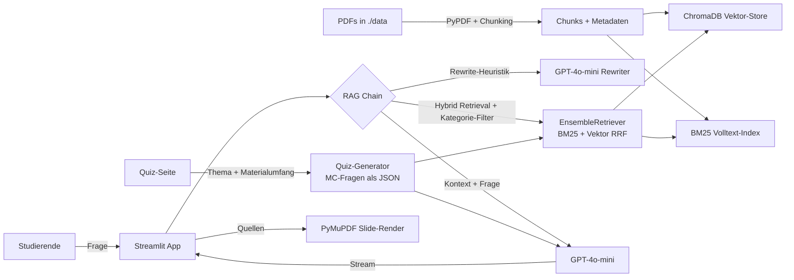

# BI-Tutor

**Retrieval-Augmented-Generation Prototyp für die Vorlesung *Business Intelligence & Analytics***
am Lehrstuhl für ABWL und Wirtschaftsinformatik 1, Universität Stuttgart.

Der BI-Tutor beantwortet Studierenden-Fragen ausschließlich auf Basis der hinterlegten
Vorlesungs-, Übungs- und Klausurmaterialien und macht seine Quellen mit Folie und
Modul transparent. Er erfüllt die in [`docs/SRS.md`](docs/SRS.md) priorisierten
SRS-Anforderungen **F1, F2, F3, F4, F5, N2, N3**.

| Status (v1.4)            | Wert                      |
|--------------------------|---------------------------|
| Pass-Rate                | **0.90**                  |
| Scope-Accuracy           | **1.00**                  |
| Source-Rate              | **1.00**                  |
| Judge Overall            | **4.46 / 5.00**           |
| Correctness / Faithfulness | **5.00 / 5.00**         |
| Avg-Latency / p95        | 3.03 s / 4.91 s           |

Vollständige Auswertung der vier Iterationen: [`docs/Evaluation.md`](docs/Evaluation.md).

---

## Architektur



| Schicht          | Tool                                                        |
|------------------|-------------------------------------------------------------|
| Frontend         | Streamlit Multipage (Dialog / Forum / Quiz / Admin / Evaluation) |
| Orchestrierung   | LangChain (ChatPromptTemplate + EnsembleRetriever + Stream) |
| Retrieval        | **Hybrid**: BM25 (rank-bm25) + Vektor (Chroma) per RRF       |
| Embeddings       | `paraphrase-multilingual-MiniLM-L12-v2` (lokal, HuggingFace) |
| LLM              | OpenAI `gpt-4o-mini` (Default, konfigurierbar)              |
| Forum-DB         | SQLite (`forum.db`, lokal je Entwickler)                    |
| Slide-Preview    | PyMuPDF (on-demand, gecached)                               |

---

## Was ist drin

Fünf Seiten in der App (Top-Navigation):

| Seite          | Inhalt                                                                 |
|----------------|------------------------------------------------------------------------|
| **Dialog**     | Streaming-Chat mit Quellen-Expander, Multi-Turn-Kontext, **Wissensbasis-Filter** (Vorlesungen / Übungen / Altklausuren) und Slide-Vorschau pro Quelle |
| **Forum**      | Threads + Antworten zwischen Studierenden, Tutor:innen und Lehrenden mit Rollen-Badges, Pin & Endorse |
| **Quiz**       | Generiert Multiple-Choice-Selbsttests aus der Wissensbasis – Thema, Materialumfang und Schwierigkeit wählbar, deterministische Auswertung mit Begründung und Quelle je Frage (nur in der Session) |
| **Administration** | System-Status, PDFs ingestieren, Chunk-Browser (semantische Suche + Slide-Preview), LLM-Probe |
| **Evaluation** | Eval-Runs inline starten, Reports browsen, Versions vergleichen (Pass-Rate, Latenz, Judge-Scores) |

Forum und Dialog sind verlinkt: ein Klick aus dem Forum-Thread schickt die Frage an den Tutor, eine Tutor-Antwort lässt sich mit einem Klick als neuer Forum-Thread eröffnen.

Der **Wissensbasis-Filter** im Dialog und der Materialumfang im Quiz teilen sich dieselbe
Logik: Beide schränken das Retrieval pro Anfrage auf die Kategorien **Vorlesung**,
**Übung** und/oder **Altklausur** ein (Vektor-Seite via Chroma-Metadatenfilter, BM25-Seite
über das passende Chunk-Subset). Ohne Auswahl wird die gesamte Wissensbasis durchsucht.

---

## SRS-Abdeckung

Der System-Prompt in [`rag/chain.py`](rag/chain.py) implementiert die priorisierten
Anforderungen aus [`docs/SRS.md`](docs/SRS.md):

| ID  | Anforderung           | Umsetzung                                                          |
|-----|-----------------------|--------------------------------------------------------------------|
| F1  | Dokumentenbasierung   | EnsembleRetriever liefert Kontext, Prompt erzwingt "nur Kontext"   |
| F2  | Quellenangabe         | Inline-Zitation + verpflichtende `Quellen:`-Liste am Antwort-Ende   |
| F3  | Adaptive Erklärung    | Prompt-Regel erkennt "einfach"/"Erstsemester" und passt an          |
| F4  | Glossarfunktion       | Prompt liefert prägnante Definitionen bei "Was bedeutet…?"          |
| F5  | Themenfokus           | Out-of-Scope-Klausel + Regex-Refusal-Erkennung                      |
| N2  | Korrektheit           | Strikte Bindung an Vorlesungskontext, Judge-Score 5.0 / 5           |
| N3  | Faithfulness          | Unsicherheits-Klausel, verbotene Begriffe explizit, Judge 5.0 / 5    |

---

## Quickstart

```bash
git clone https://github.com/KIPraktikumGruppeNAZ/TutorBusinessIntelligence.git
cd TutorBusinessIntelligence

python3 -m venv .venv && source .venv/bin/activate
pip install -r requirements.txt

cp .env.example .env
# OPENAI_API_KEY eintragen (gpt-4o-mini reicht)

# Vorlesungs-PDFs nach ./data legen, dann:
python -m rag.ingestion --reset

streamlit run app.py
```

Browser öffnet automatisch http://localhost:8501.

> Hinweis: Die Vorlesungs-PDFs sind aus Urheberrechtsgründen **nicht** im Repo
> (in `.gitignore`). Gruppen-Mitglieder erhalten sie über den internen Kanal.

---

## Evaluation reproduzieren

```bash
python -m evaluation.run_eval --version v1.4               # ohne Judge, ~30 s
python -m evaluation.run_eval --version v1.4 --judge       # mit Judge, ~60 s
```

- Testfälle: [`evaluation/test_cases.json`](evaluation/test_cases.json) – die 8 TCs
  aus [`docs/Testcases.md`](docs/Testcases.md) plus zwei OOS-Smalltalk-Fälle.
- Report: `evaluation/results/<timestamp>_<version>.{json,csv}` – versioniert.
- Quantitative Metriken nach [`docs/Automation.md`](docs/Automation.md):
  Pass-Rate, Trefferquote, Antwortzeit, Quellenquote, Scope-Erkennung,
  Ablehnungsrate.
- LLM-as-a-Judge ([`evaluation/judge.py`](evaluation/judge.py)) bewertet je
  Antwort fünf Dimensionen (0–5): correctness, didactic, structure,
  source_usage, faithfulness.

Eval-Iterationsverlauf:

| Tag    | Schwerpunkt                          | Pass | Scope | Keyword | Judge ⌀ |
|--------|--------------------------------------|------|-------|---------|---------|
| `v1.0` | Initialer Lauf                       | 0.50 | 0.60  | 0.68    | –       |
| `v1.1` | Umlaut-Bug Fix in Refusal-Detection  | 0.80 | 0.90  | 0.82    | –       |
| `v1.2` | TOP_K=7 (Regression, verworfen)      | 0.70 | 0.80  | 0.75    | –       |
| `v1.3` | Hybrid BM25 + Vektor                 | 0.90 | 0.90  | 0.82    | 4.32    |
| `v1.4` | Strikte Zitation, Schwelle 6 s       | **0.90** | **1.00** | **0.87** | **4.46** |

Volle Auswertung mit Lessons Learned: [`docs/Evaluation.md`](docs/Evaluation.md).

---

## Projektlayout

```
.
├── app.py                    # Streamlit Main-Page (Dialog) + Wissensbasis-Filter
├── pages/
│   ├── 1_Admin.py            # Indexierung, Chunk-Browser, LLM-Probe
│   ├── 2_Evaluation.py       # Eval-Runs starten + Reports browsen
│   ├── 3_Forum.py            # Threads, Antworten, Rollen
│   └── 4_Quiz.py             # Multiple-Choice-Quiz aus der Wissensbasis
├── rag/
│   ├── config.py             # Settings via .env
│   ├── ingestion.py          # PDF → Chunks (mit Metadaten + Kategorie) → Chroma
│   ├── chain.py              # RAG-Chain + Hybrid-Retrieval (Kategorie-Filter) + Quiz-Generierung
│   ├── slides.py             # PyMuPDF Slide-Rendering
│   └── ui.py                 # Theme + Slide-Header + Source-Cards + Topnav
├── forum/
│   └── storage.py            # SQLite-Persistenz für Threads + Posts
├── evaluation/
│   ├── test_cases.json       # TC-001 … TC-008 + OOS
│   ├── run_eval.py           # Automatisierter Testlauf
│   ├── judge.py              # LLM-as-a-Judge (5 Dimensionen)
│   └── results/              # versionierte JSON/CSV Reports (gitignored)
├── docs/
│   ├── SRS.md                # Stakeholder, F1–F5, N1–N5, Erfolgskriterien
│   ├── Testplan.md           # Testfalltypen A–G
│   ├── Testcases.md          # konkrete Testfälle
│   ├── Automation.md         # Toolchain, Workflow, Bewertungsregeln
│   ├── KnowledgeBase.md      # Quellenstrategie, Chunking, Lessons
│   └── Evaluation.md         # Iterationen v1.0 → v1.4, Lessons Learned
├── data/                     # Eingabe-PDFs (gitignored)
├── chroma_db/                # persistierter Vektorstore (gitignored)
└── .streamlit/config.toml    # Theme (Cyan-Akzent, weißer Hintergrund)
```

---

## Visuelle Designsprache

Das UI ist an die Folien des Lehrstuhls angelehnt:

- Weißer Hintergrund, viel Whitespace, **BIA-Cyan** `#00B0E0` als einziger Akzent
- Anthrazitfarbene Slide-Titel oben links, dünne Trennlinie darunter
- Chair-Label "Lehrstuhl für ABWL und Wirtschaftsinformatik 1" + Status-Pill
- Cyan-Bullet-Punkte für Aufzählungen und Quellen-Karten
- Slide-Footer mit `Universität Stuttgart · Lehrstuhl …` links und Tool-Marke rechts
